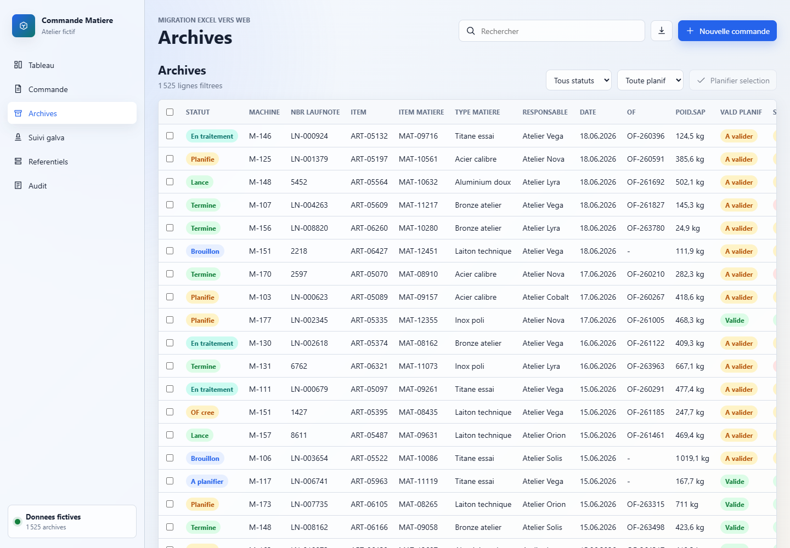
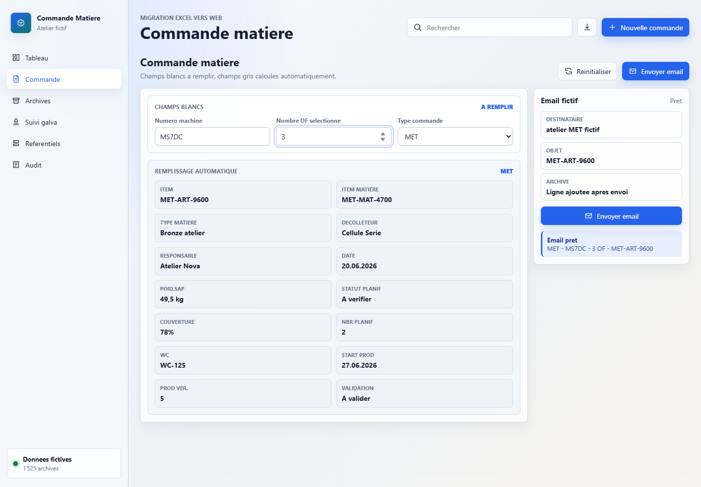

# Gestions Commande Matière

## Rapport complet

Ce depot public presente le concept, les fonctions, les choix de conception, les outils utilises, les commandes locales et les captures d'ecran de l'application. Il est genere par l'orchestrateur uniquement apres validation de publication publique.

## Concept

Application web locale pour simuler et suivre les commandes matière, les archives et les référentiels sans exposer les données sensibles du classeur source.

Fournir une interface simplifiée et sécurisée pour gérer les flux de commande matière (PROD/MET), les archives, les indicateurs et les référentiels, en reproduisant la structure et les volumes du classeur métier COMMANDE_MATIERE.xlsm mais avec des données fictives.

Public vise: Utilisateurs opérationnels internes (production, logistique, planification) et développeurs souhaitant comprendre ou étendre le modèle de données.


## Fonctionnement de l'application

L'application fonctionne entièrement côté client en HTML/CSS/JavaScript. Elle démarre sur un module de saisie (Commande) où l'utilisateur entre machine, nombre d'OF et type (PROD/MET). Les champs calculés sont générés localement via des fonctions déterministes basées sur des hash. Une fois validée, la commande est ajoutée aux Archives, qui offrent filtrage, tri, pagination et édition inline. Les modules Référentiels et Suivi galva exposent des listes modifiables. Les indicateurs (KPI) sont mis à jour dynamiquement depuis les données locales. Toutes les modifications sont persistées dans localStorage.

## Fonctions de l'application

- Création de commandes matière fictives (PROD/MET)
- Auto-remplissage des champs calculés (item, type matière, couverture, statut planif)
- Simulation d'envoi d'emails fictifs et archivage automatique
- Gestion des archives (filtrage, tri, pagination, édition inline)
- Consultation et modification des référentiels (SPC, options, MET, CW724R, seuils manco, articles de vérification)
- Export de l'état local en JSON
- Visualisation des indicateurs (flux mensuel, répartition des statuts, alertes planif)
- Saisie rapide de commandes matière avec auto-remplissage
- Saisie rapide avec auto-remplissage déterministe
- Édition inline des archives et référentiels
- Filtrage, tri et pagination côté client
- Visualisation dynamique des KPI (graphiques SVG, alertes planif)
- Simulation traçable d'actions SAP (fenêtre modale avec progression et journal)
- Génération reproductible de données fictives via seeds
- Export JSON de l’état local
- Design responsive compatible mobile
- Notifications toast pour feedback utilisateur
- Régénération volontaire du jeu de données fictif

## Actualisations et evolution

- Synchronisation de la documentation projet avec l'orchestrateur global (2026-06-28)
- Validation de l'audit sécurité : statut OK_PUBLIC (2026-06-28)
- Génération initiale de 1 525 lignes d'archives fictives pour correspondre au volume du classeur source
- Mise à jour du CHANGELOG pour refléter l'état PUBLIC_READY
- Ajout de captures d'écran dans la documentation (2026-06-20)
- Statut courant: PUBLIC_READY.
- Securite: OK_PUBLIC.
- Fonctionnement: FONCTIONNEL.

## Comment le projet a ete reflechi et construit

Le projet a été conçu comme une reconstruction sécurisée : il conserve la structure, les volumes, les noms de colonnes et les cas d'usage du classeur source, mais remplace systématiquement les données métiers par des valeurs fictives générées localement à partir de seeds reproductibles. L’approche statique (sans backend) garantit zéro exposition de données. Le design suit les principes Windows 11 (Mica, Segoe UI, navigation latérale, boutons compacts) et intègre une compatibilité mobile via des tables horizontales scrollables. La modularité des vues (Tableau, Commande, Archives, Référentiels) facilite la maintenance. La fenêtre SAP simulée assure traçabilité des actions, tandis que les calculs JavaScript traduisent fidèlement les formules Excel (IFERROR, XLOOKUP) pour les statuts planif et taux de couverture.

Cette section doit expliquer les choix qui ont guide le projet: besoin de depart, structure retenue, modules principaux, compromis techniques, interface ou logique metier, et raisons des outils utilises.

### Outils, IA et moteurs utilises

- localStorage
- SVG pour les graphiques
- Fenêtre modale pour les actions SAP simulées
- Notifications toast
- Génération de données fictives via seeds
- HTML5, CSS3, JavaScript vanilla
- Calculs locaux pour les statuts et couvertures
- Filtrage et tri côté client (JavaScript vanilla)
- Pagination côté client
- Édition inline avec gestion des événements
- Design Windows 11 (Mica, Segoe UI, boutons compacts)

### Options techniques detectees

- Type de projet: static-html
- Statut securite: OK_PUBLIC

### Stack et dependances principales

- HTML statique
- HTML5, CSS3, JavaScript vanilla
- Calculs locaux pour les statuts et couvertures
- Filtrage et tri côté client (JavaScript vanilla)
- Pagination côté client
- Édition inline avec gestion des événements
- Design Windows 11 (Mica, Segoe UI, boutons compacts)

### Scripts disponibles

- Aucun script detecte.

### Dependances applicatives

- Aucune dependance applicative detectee.

### Dependances de developpement

- Aucune dependance de developpement detectee.

## Automatisations et comportements internes

- Auto-remplissage des champs calculés lors de la saisie
- Génération automatique des identifiants (commande, OF)
- Calcul du statut planif basé sur la couverture
- Sauvegarde automatique dans localStorage
- Régénération du jeu de données fictif sur demande
- Export JSON de l'état courant
- Affichage dynamique des indicateurs (KPI)

## Installation locale

Aucune installation requise. L'application est un projet statique HTML/CSS/JavaScript. Prérequis : navigateur web moderne (Chrome, Firefox, Edge, Safari). Aucun serveur local n'est nécessaire : ouvrir directement le fichier index.html dans le navigateur.

### Pre-requis
- Verifier les pre-requis propres au projet dans le README.

### Commandes
```powershell
# Aucune installation requise
Start-Process .\index.html
```

## Lancement

```powershell
Start-Process .\index.html
```

## Utilisation

1. Ouvrir index.html dans un navigateur. 2. Utiliser la barre latérale pour naviguer entre les vues (Tableau, Commande, Archives, Référentiels). 3. Dans Commande : saisir machine, nombre d'OF et type (PROD/MET) ; les champs gris se remplissent automatiquement ; cliquer sur 'Envoyer' pour simuler l'envoi d'un email et archiver la ligne. 4. Dans Archives : filtrer/sortir/paginer, sélectionner des lignes pour planification en masse, modifier directement les cellules. 5. Dans Référentiels : consulter et éditer les listes SPC, options, MET, etc. 6. Exporter l’état courant en JSON via le bouton dédié. Les données sont sauvegardées automatiquement dans localStorage.

## Captures d'ecran





## Variables d'environnement

Aucune variable d'environnement n'a ete detectee par l'orchestrateur.

## Securite

Ne jamais publier `.env`, tokens, sessions, logs sensibles, cles privees ou donnees personnelles.
